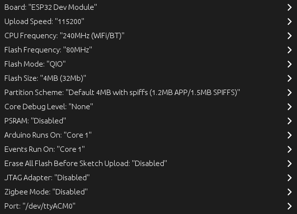

# BalancaDigital
Projeto de balança digital, utilizando uma balança, um HX711 e uma ESP32.

Foi utilizado o Arduino IDE e as bibliotecas [ESPAsyncWebServer.h](https://github.com/me-no-dev/ESPAsyncWebServer), [AsyncTCP.h](https://github.com/ESP32Async/AsyncTCP), HX771 by Bogdan Necula

Configurações da ESP32

