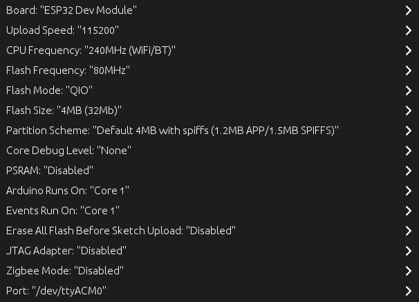

# BalancaDigital
Projeto de balança digital, utilizando uma balança, um HX711 e uma ESP32.

Foi utilizado o Arduino IDE e as bibliotecas [ESPAsyncWebServer.h](https://github.com/me-no-dev/ESPAsyncWebServer), [AsyncTCP.h](https://github.com/ESP32Async/AsyncTCP), HX771 by Bogdan Necula

Calibre a sua balança utilizando o calibracao_v3.ino e depois, utilize a versao_atual_v3.ino embarcado na esp32.

Configurações da ESP32

PINOUTS

CALIBRATION USED POINTS

